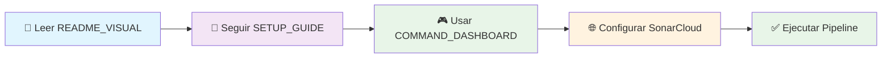

# 🗂️ ÍNDICE VISUAL - NAVEGACIÓN RÁPIDA

<div align="center">


</div>

---

## 🎯 **DOCUMENTACIÓN PRINCIPAL**

<div align="center">

| 📄 **DOCUMENTO** | 🎨 **TIPO** | 📋 **DESCRIPCIÓN** | 🔗 **ENLACE** |
|:---:|:---:|:---:|:---:|
| **README Visual** | 🌟 Principal | Documentación moderna y atractiva | [`README_VISUAL.md`](./README_VISUAL.md) |
| **Setup Guide** | 🚀 Tutorial | Guía paso a paso con diagramas | [`SETUP_VISUAL_GUIDE.md`](./SETUP_VISUAL_GUIDE.md) |
| **Command Dashboard** | 🎮 Comandos | Panel de control de comandos | [`COMMAND_DASHBOARD.md`](./COMMAND_DASHBOARD.md) |
| **SonarCloud Setup** | 🌐 Config | Configuración SonarCloud detallada | [`SONARCLOUD_SETUP.md`](./SONARCLOUD_SETUP.md) |

</div>

---

## 🛠️ **ARCHIVOS DE CONFIGURACIÓN**

<div align="center">

| ⚙️ **ARCHIVO** | 🎯 **FUNCIÓN** | 📁 **UBICACIÓN** |
|:---:|:---:|:---:|
| **Jenkinsfile** | Pipeline CI/CD | [`./Jenkinsfile`](./Jenkinsfile) |
| **sonar-project.properties** | SonarCloud config | [`./sonar-project.properties`](./sonar-project.properties) |
| **docker-compose.yml** | Stack completo | [`./docker-compose.yml`](./docker-compose.yml) |
| **pom.xml** | Maven config | [`./pom.xml`](./pom.xml) |

</div>

---

## 🧪 **PRUEBAS Y TESTING**

<div align="center">

| 🎯 **TIPO PRUEBA** | 📊 **ARCHIVOS** | 📁 **UBICACIÓN** |
|:---:|:---:|:---:|
| **Pruebas Unitarias** | StudentTest.java | [`src/test/java/.../domain/`](./src/test/java/pe/edu/vallegrande/msvstudents/unit/domain/) |
| **Pruebas de Servicio** | StudentServiceTest.java | [`src/test/java/.../service/`](./src/test/java/pe/edu/vallegrande/msvstudents/unit/service/) |
| **Pruebas de Integración** | StudentControllerTest.java | [`src/test/java/.../controller/`](./src/test/java/pe/edu/vallegrande/msvstudents/integration/controller/) |
| **Performance Tests** | JMeter plans | [`performance-tests/`](./performance-tests/) |

</div>

---

## 🔧 **SCRIPTS DE AUTOMATIZACIÓN**

<div align="center">

| 🚀 **SCRIPT** | 🎯 **FUNCIÓN** | 💻 **COMANDO** |
|:---:|:---:|:---:|
| **Pipeline Completo** | CI/CD full | `.\scripts\run-full-pipeline.ps1` |
| **SonarCloud Analysis** | Análisis calidad | `.\scripts\run-sonarcloud-analysis.ps1` |
| **JMeter Testing** | Performance | `.\scripts\run-jmeter.ps1` |
| **Docker Build** | Containerización | `.\scripts\build-docker.ps1` |

</div>

---

## 🌐 **ENLACES RÁPIDOS**

<div align="center">

### 🔗 **SERVICIOS EXTERNOS**

| 🌍 **Servicio** | 🎯 **Función** | 🔗 **URL** |
|:---:|:---:|:---:|
| **SonarCloud** | Análisis de código | [Dashboard](https://sonarcloud.io/project/overview?id=vallegrande_vg-ms-students) |
| **Jenkins Local** | CI/CD Pipeline | [http://localhost:8080](http://localhost:8080) |
| **API Swagger** | Documentación API | [http://localhost:8080/swagger-ui.html](http://localhost:8080/swagger-ui.html) |
| **Health Check** | Estado aplicación | [http://localhost:8080/actuator/health](http://localhost:8080/actuator/health) |

</div>

---

## 📊 **ESTRUCTURA DEL PROYECTO**

```
🏗️ vg-ms-students/
├── 📄 README_VISUAL.md              # 🌟 Documentación principal moderna
├── 📄 SETUP_VISUAL_GUIDE.md         # 🚀 Guía de configuración paso a paso  
├── 📄 COMMAND_DASHBOARD.md           # 🎮 Panel de comandos rápidos
├── 📄 SONARCLOUD_SETUP.md            # 🌐 Setup SonarCloud detallado
├── 📄 INDEX_NAVIGATION.md            # 🗂️ Este archivo de navegación
│
├── 🔧 Jenkinsfile                    # Pipeline CI/CD automatizado
├── ⚙️ sonar-project.properties       # Configuración SonarCloud  
├── 🐳 docker-compose.yml             # Stack completo Docker
├── 📦 pom.xml                        # Configuración Maven
│
├── 📁 src/
│   ├── 📁 main/java/                 # Código fuente principal
│   └── 📁 test/java/                 # Pruebas unitarias e integración
│
├── 📁 scripts/                       # Scripts de automatización PowerShell
│   ├── 🚀 run-full-pipeline.ps1     # Pipeline completo
│   ├── 📊 run-sonarcloud-analysis.ps1 # Análisis SonarCloud  
│   ├── ⚡ run-jmeter.ps1              # Pruebas performance
│   └── 🐳 build-docker.ps1           # Build Docker
│
├── 📁 performance-tests/             # Planes de prueba JMeter
│   ├── 📈 load-test-plan.jmx
│   ├── 📊 stress-test-plan.jmx
│   └── 📋 test-data.csv
│
└── 📁 .github/workflows/             # GitHub Actions (opcional)
```

---

## 🎮 **ACCIONES RÁPIDAS**

<div align="center">

### ⚡ **LOS MÁS USADOS**

| 🔥 **Acción** | 💻 **Comando** | ⏱️ **Tiempo** |
|:---:|:---:|:---:|
| **🚀 Pipeline Completo** | `.\scripts\run-full-pipeline.ps1` | ~15 min |
| **🧪 Solo Pruebas** | `mvn test` | ~5 min |
| **🐳 Levantar Stack** | `docker-compose up -d` | ~2 min |
| **📊 Análisis SonarCloud** | `.\scripts\run-sonarcloud-analysis.ps1` | ~3 min |

</div>

---

## 🎯 **FLUJO DE TRABAJO RECOMENDADO**

<div align="center">



**1️⃣** Leer [`README_VISUAL.md`](./README_VISUAL.md) para entender el proyecto
**2️⃣** Seguir [`SETUP_VISUAL_GUIDE.md`](./SETUP_VISUAL_GUIDE.md) para configurar
**3️⃣** Usar [`COMMAND_DASHBOARD.md`](./COMMAND_DASHBOARD.md) para comandos
**4️⃣** Configurar SonarCloud con [`SONARCLOUD_SETUP.md`](./SONARCLOUD_SETUP.md)
**5️⃣** ¡Ejecutar pipeline y disfrutar! 🎉

</div>

---

<div align="center">

## 🎉 **¡NAVEGACIÓN COMPLETAMENTE ORGANIZADA!**

### ✅ **TODO ESTÁ DOCUMENTADO Y VISUAL**

**🎨 Interfaz moderna • 📋 Guías paso a paso • 🎮 Comandos rápidos • 🌐 Enlaces directos**

---

*Navegación creada para máxima usabilidad* 🚀

</div>