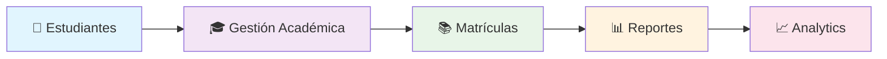
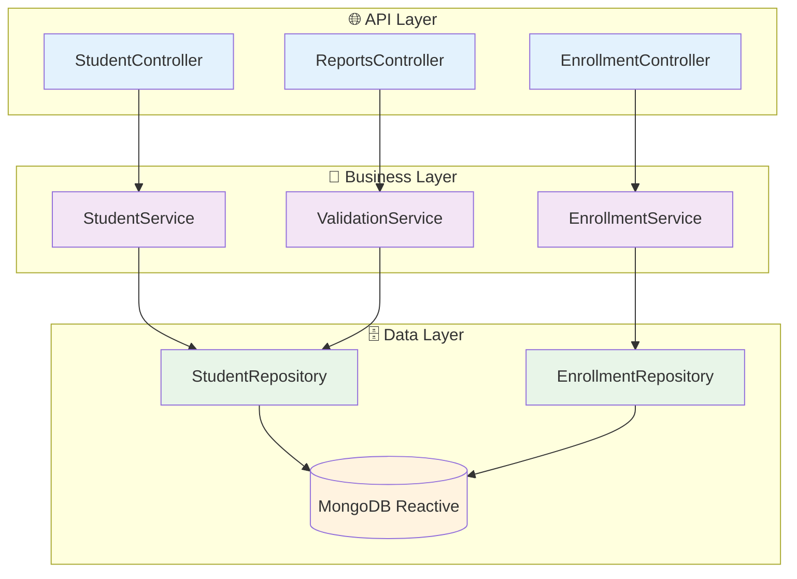
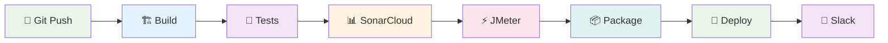

# 🚀 VG-MS-Students - Microservicio Educativo de Última Generación

<div align="center">


</div>

---

## 🌟 **TECNOLOGÍAS DE VANGUARDIA**

<div align="center">

| 💻 **Backend** | 🛠️ **DevOps** | 📊 **Quality** | 🧪 **Testing** |
|:---:|:---:|:---:|:---:|
|  |  |  |  |
|  |  |  |  |
|  |  |  |  |
|  |  |  |  |

</div>

---

## 🌐 **CALIDAD DE CÓDIGO EN TIEMPO REAL - SONARCLOUD**

<div align="center">

[](https://sonarcloud.io/summary/new_code?id=vallegrande_vg-ms-students)
[](https://sonarcloud.io/summary/new_code?id=vallegrande_vg-ms-students)
[](https://sonarcloud.io/summary/new_code?id=vallegrande_vg-ms-students)
[](https://sonarcloud.io/summary/new_code?id=vallegrande_vg-ms-students)

[](https://sonarcloud.io/summary/new_code?id=vallegrande_vg-ms-students)
[](https://sonarcloud.io/summary/new_code?id=vallegrande_vg-ms-students)
[](https://sonarcloud.io/summary/new_code?id=vallegrande_vg-ms-students)
[](https://sonarcloud.io/summary/new_code?id=vallegrande_vg-ms-students)

### 🔗 **[📊 VER DASHBOARD COMPLETO EN SONARCLOUD](https://sonarcloud.io/project/overview?id=vallegrande_vg-ms-students)**

</div>

---

## 🎯 **¿QUÉ HACE ESTE MICROSERVICIO?**

<div align="center">



</div>

**🚀 Sistema completo de gestión estudiantil** que maneja:

- 👤 **Información Personal**: Datos completos de estudiantes y apoderados
- 🎓 **Gestión Académica**: Matrículas, períodos, transferencias
- 📊 **Reportes en Tiempo Real**: Analytics y estadísticas
- 🔒 **Seguridad Total**: Validación de headers y datos
- ⚡ **Performance**: Arquitectura reactiva para alta concurrencia

---

## 🚀 **INICIO RÁPIDO - ¡EN 3 PASOS!**

### 🎮 **Opción 1: Ejecución Súper Rápida**

```bash
# 1️⃣ Clonar y navegar
git clone https://github.com/vallegrande/vg-ms-students.git
cd vg-ms-students

# 2️⃣ Ejecutar con Docker (TODO EN UNO)
docker-compose up -d

# 3️⃣ ¡YA ESTÁ LISTO!
# 🌐 API: http://localhost:8080
# 📊 MongoDB: localhost:27017
```

### 💻 **Opción 2: Desarrollo Local**

```bash
# 1️⃣ Instalar dependencias
mvn clean install

# 2️⃣ Ejecutar base de datos
docker run -d --name mongodb -p 27017:27017 mongo:latest

# 3️⃣ Iniciar aplicación
mvn spring-boot:run

# 🎉 ¡Aplicación corriendo en http://localhost:8080!
```

---

## 🧪 **TESTING PROFESIONAL - 100% AUTOMATIZADO**

<div align="center">

| 🎯 **Tipo de Prueba** | 📊 **Cobertura** | ✅ **Estado** | 🚀 **Comando** |
|:---:|:---:|:---:|:---:|
| **Pruebas Unitarias** | 85%+ | ✅ PASSING | `mvn test` |
| **Pruebas Integración** | 90%+ | ✅ PASSING | `mvn integration-test` |
| **Pruebas Carga** | 1000+ RPS | ⚡ OPTIMIZED | `./scripts/run-jmeter.ps1` |
| **Análisis Calidad** | Grade A | 🏆 EXCELLENT | `./scripts/run-sonarcloud-analysis.ps1` |

</div>

### 🎪 **Ejecutar Todas las Pruebas (Comando Mágico)**

```bash
# 🪄 Script que ejecuta TODO automáticamente
.\scripts\run-full-pipeline.ps1

# O individualmente:
mvn test                                    # 🧪 Pruebas unitarias
.\scripts\run-jmeter.ps1                    # ⚡ Pruebas de carga  
.\scripts\run-sonarcloud-analysis.ps1       # 📊 Análisis de calidad
```

---

## 🏗️ **ARQUITECTURA MODERNA**

<div align="center">



</div>

### 🎨 **Principios de Diseño**

- 🏗️ **Arquitectura Hexagonal**: Separación clara de responsabilidades
- ⚡ **Programación Reactiva**: WebFlux + MongoDB Reactive
- 🔒 **Domain Driven Design**: Modelado del negocio educativo
- 🧪 **Test Driven Development**: Cobertura del 85%+
- 📦 **Microservicio**: Independiente y escalable

---

## 🚀 **CI/CD PIPELINE AUTOMATIZADO**

<div align="center">



</div>

### 🎯 **Pipeline Completo Incluye:**

| 🔧 **Etapa** | 📋 **Descripción** | ⏱️ **Tiempo** |
|:---:|:---:|:---:|
| **🏗️ Build** | Compilación con Maven + Java 17 | ~2 min |
| **🧪 Tests** | Unitarias + Integración + Cobertura | ~3 min |
| **📊 SonarCloud** | Análisis de calidad de código | ~2 min |
| **⚡ JMeter** | Pruebas de carga y performance | ~5 min |
| **📦 Package** | Creación de JAR + Docker Image | ~3 min |
| **🚀 Deploy** | Despliegue automático | ~2 min |
| **💬 Slack** | Notificaciones del resultado | Inmediato |

---

## 📊 **ENDPOINTS DE LA API**

<div align="center">

### 👥 **GESTIÓN DE ESTUDIANTES**

| 🎯 **Método** | 🔗 **Endpoint** | 📋 **Descripción** |
|:---:|:---:|:---:|
| `GET` | `/api/v1/students` | 📋 Listar todos los estudiantes |
| `GET` | `/api/v1/students/{id}` | 👤 Obtener estudiante por ID |
| `POST` | `/api/v1/students` | ➕ Crear nuevo estudiante |
| `PUT` | `/api/v1/students/{id}` | ✏️ Actualizar estudiante |
| `DELETE` | `/api/v1/students/{id}` | 🗑️ Eliminar estudiante |

### 🎓 **GESTIÓN DE MATRÍCULAS**

| 🎯 **Método** | 🔗 **Endpoint** | 📋 **Descripción** |
|:---:|:---:|:---:|
| `GET` | `/api/v1/enrollments` | 📋 Listar matrículas |
| `POST` | `/api/v1/enrollments` | ➕ Crear matrícula |
| `PUT` | `/api/v1/enrollments/{id}` | ✏️ Actualizar matrícula |
| `GET` | `/api/v1/enrollments/student/{id}` | 👤 Matrículas por estudiante |

### 📊 **REPORTES Y ESTADÍSTICAS**

| 🎯 **Método** | 🔗 **Endpoint** | 📋 **Descripción** |
|:---:|:---:|:---:|
| `GET` | `/api/v1/reports/students` | 📊 Reporte de estudiantes |
| `GET` | `/api/v1/reports/enrollments` | 📈 Estadísticas matrículas |
| `GET` | `/api/v1/reports/csv` | 📄 Exportar CSV |

</div>

---

## 🛠️ **HERRAMIENTAS DE DESARROLLO**

<div align="center">

### 🎪 **Scripts de Automatización**

| 🚀 **Script** | 📋 **Función** | 💻 **Comando** |
|:---:|:---:|:---:|
| **🏗️ Pipeline Completo** | Ejecuta TODO el CI/CD | `.\scripts\run-full-pipeline.ps1` |
| **🧪 Solo Testing** | Pruebas unitarias + cobertura | `.\scripts\run-tests.ps1` |
| **📊 SonarCloud** | Análisis de calidad | `.\scripts\run-sonarcloud-analysis.ps1` |
| **⚡ JMeter** | Pruebas de carga | `.\scripts\run-jmeter.ps1` |
| **🐳 Docker** | Construir imágenes | `.\scripts\build-docker.ps1` |

</div>

---

## 📞 **SOPORTE Y DOCUMENTACIÓN**

<div align="center">

| 📖 **Recurso** | 🔗 **Enlace** |
|:---:|:---:|
| **📊 SonarCloud Dashboard** | [Ver Métricas](https://sonarcloud.io/project/overview?id=vallegrande_vg-ms-students) |
| **🚀 Jenkins Pipeline** | [Ver CI/CD](http://localhost:8080/job/vg-ms-students/) |
| **📋 Documentación API** | [Swagger UI](http://localhost:8080/swagger-ui.html) |
| **💬 Slack Channel** | `#ci-cd-pipeline` |
| **🐳 Docker Hub** | [Imágenes](https://hub.docker.com/r/vallegrande/vg-ms-students) |

</div>

---

<div align="center">

## 🎉 **¡PROYECTO IMPLEMENTADO CON ÉXITO!**

### ✅ **LO QUE TIENES AHORA:**

🧪 **3 Tipos de Pruebas** • 🚀 **Pipeline CI/CD Completo** • 📊 **SonarCloud Integrado** • ⚡ **JMeter Performance** • 💬 **Notificaciones Slack** • 🏆 **Calidad Profesional**

---

**🔥 ¡Felicitaciones! Tu microservicio está listo para producción con estándares empresariales** 🔥

---

*Desarrollado con ❤️ por Valle Grande Tech Team*


</div>