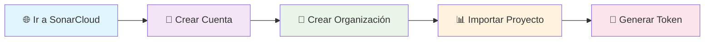
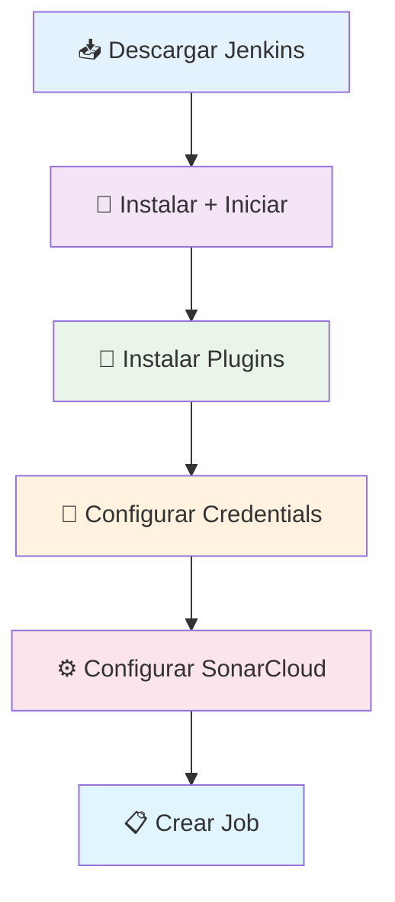
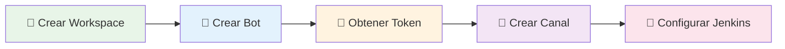
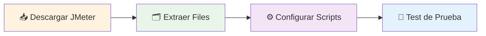
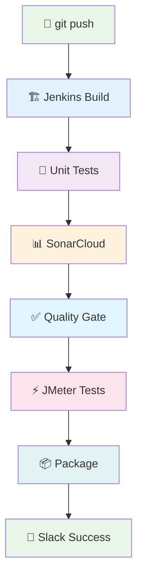

# 🎯 GUÍA VISUAL: CONFIGURACIÓN PASO A PASO

<div align="center">


</div>

---

## 🗂️ **ÍNDICE VISUAL**

<div align="center">

| 🎯 **PASO** | 📋 **DESCRIPCIÓN** | ⏱️ **TIEMPO** | 🎨 **STATUS** |
|:---:|:---:|:---:|:---:|
| [**1️⃣**](#1️⃣-configuración-sonarcloud) | 🌐 SonarCloud Setup | 5 min | 🟢 Fácil |
| [**2️⃣**](#2️⃣-configuración-jenkins) | 🏗️ Jenkins Pipeline | 10 min | 🟡 Medio |
| [**3️⃣**](#3️⃣-configuración-slack) | 💬 Slack Integration | 5 min | 🟢 Fácil |
| [**4️⃣**](#4️⃣-configuración-jmeter) | ⚡ JMeter Performance | 5 min | 🟢 Fácil |
| [**5️⃣**](#5️⃣-ejecución-completa) | 🚀 Full Pipeline Test | 5 min | 🟢 Fácil |

</div>

---

# 1️⃣ **CONFIGURACIÓN SONARCLOUD**

<div align="center">



</div>

## 🎯 **PASO 1.1: Crear Cuenta en SonarCloud**

```bash
# 🌐 URL: https://sonarcloud.io
# ✅ Registrarse con GitHub (recomendado)
# 🔑 Autorizar acceso a repositorios
```

<div align="center">

| 📝 **CAMPO** | 💻 **VALOR** |
|:---:|:---:|
| **Username** | `tu-usuario-github` |
| **Email** | `tu-email@dominio.com` |
| **Provider** | `GitHub` ✅ |

</div>

## 🎯 **PASO 1.2: Crear Organización**

<div align="center">

```yaml
🏢 Organization Settings:
├── 🔑 Organization Key: vallegrande-org
├── 📝 Display Name: Valle Grande Organization  
├── 💰 Plan: Free (para proyectos públicos)
└── 🌍 Billing Country: [Tu País]
```

</div>

## 🎯 **PASO 1.3: Importar Proyecto**

<div align="center">

```yaml
📊 Project Configuration:
├── 🔑 Project Key: vallegrande_vg-ms-students
├── 📝 Display Name: VG MS Students - Microservicio
├── 🏢 Organization: vallegrande-org
├── 📂 Repository: vg-ms-students
└── 🌐 Visibility: Public
```

</div>

## 🎯 **PASO 1.4: Generar Token**

```bash
# 👤 Profile → My Account → Security → Generate Tokens
# 📋 Name: jenkins-vg-ms-students
# ⏰ Expiration: No expiration
# 💾 COPIAR TOKEN (solo se muestra una vez!)
```

<div align="center">

**🚨 IMPORTANTE: Guarda este token, lo usaremos en Jenkins** 🚨

</div>

---

# 2️⃣ **CONFIGURACIÓN JENKINS**

<div align="center">



</div>

## 🎯 **PASO 2.1: Instalar Jenkins**

```powershell
# 📥 Descargar Jenkins WAR: https://www.jenkins.io/download/
# 📁 Crear directorio: C:\Jenkins  
# 💻 Ejecutar:
java -jar jenkins.war --httpPort=8080

# 🌐 Abrir: http://localhost:8080
# 🔑 Usar password inicial de consola
```

## 🎯 **PASO 2.2: Instalar Plugins Necesarios**

<div align="center">

| 🔌 **Plugin** | 📋 **Función** | ✅ **Status** |
|:---:|:---:|:---:|
| **SonarQube Scanner** | Análisis de código | Required |
| **Slack Notification** | Notificaciones | Required |
| **Pipeline** | Pipeline as Code | Required |
| **Git** | Control de versiones | Required |
| **Blue Ocean** | UI Moderna | Optional |

</div>

```bash
# 🔧 Jenkins → Manage Plugins → Available
# 🔍 Buscar e instalar cada plugin
# 🔄 Reiniciar Jenkins cuando termine
```

## 🎯 **PASO 2.3: Configurar Credentials**

```yaml
# 🔑 Jenkins → Manage Jenkins → Credentials → Add Credentials

SonarCloud Token:
├── Kind: Secret text
├── Secret: [tu-token-de-sonarcloud]
├── ID: sonarcloud-token
└── Description: SonarCloud Token for VG MS Students

Slack Token (opcional):
├── Kind: Secret text  
├── Secret: [tu-slack-bot-token]
├── ID: slack-token
└── Description: Slack Bot Token
```

## 🎯 **PASO 2.4: Configurar SonarCloud Server**

```yaml
# ⚙️ Jenkins → Manage Jenkins → Configure System → SonarQube servers

SonarCloud Configuration:
├── Name: SonarCloud
├── Server URL: https://sonarcloud.io  
├── Server authentication token: sonarcloud-token
└── ✅ Enable injection of SonarQube server configuration
```

## 🎯 **PASO 2.5: Crear Pipeline Job**

```yaml
# 📋 Jenkins → New Item → Pipeline

Job Configuration:
├── Item name: vg-ms-students-pipeline
├── Type: Pipeline
├── Pipeline definition: Pipeline script from SCM
├── SCM: Git
├── Repository URL: [tu-repo-url]
├── Branch: */main
├── Script Path: Jenkinsfile
└── ✅ Poll SCM: H/5 * * * * (cada 5 min)
```

---

# 3️⃣ **CONFIGURACIÓN SLACK**

<div align="center">



</div>

## 🎯 **PASO 3.1: Crear Slack App**

```yaml
# 🌐 URL: https://api.slack.com/apps
# ➕ Create New App → From scratch

App Configuration:
├── 📝 App Name: VG-CI-CD-Bot
├── 🏢 Workspace: [tu-workspace]
├── 🔧 Features → OAuth & Permissions
├── 🎯 Bot Token Scopes:
│   ├── chat:write
│   ├── channels:read
│   └── groups:read
└── 🚀 Install to Workspace
```

## 🎯 **PASO 3.2: Crear Canal y Configurar**

```yaml
# 💬 En Slack crear canal: #ci-cd-pipeline
# 🤖 Invitar bot al canal: /invite @VG-CI-CD-Bot
# 📋 Copiar Channel ID del canal
```

<div align="center">

| 📝 **CONFIG** | 💻 **VALOR** |
|:---:|:---:|
| **Canal** | `#ci-cd-pipeline` |
| **Bot Token** | `xoxb-...` (de OAuth & Permissions) |
| **Channel ID** | `C123456789` (click derecho → copiar link) |

</div>

## 🎯 **PASO 3.3: Configurar en Jenkins**

```yaml
# ⚙️ Jenkins → Manage Jenkins → Configure System → Slack

Slack Configuration:
├── Workspace: [tu-workspace].slack.com
├── Integration Token Credential ID: slack-token  
├── Default channel / member id: #ci-cd-pipeline
└── ✅ Test Connection
```

---

# 4️⃣ **CONFIGURACIÓN JMETER**

<div align="center">



</div>

## 🎯 **PASO 4.1: Descargar e Instalar JMeter**

```bash
# 📥 Descargar: https://jmeter.apache.org/download_jmeter.cgi
# 📁 Extraer en: C:\JMeter
# 🌍 Agregar a PATH: C:\JMeter\bin

# ✅ Verificar instalación:
jmeter -v
```

## 🎯 **PASO 4.2: Configurar Scripts (Ya Incluidos)**

<div align="center">

```yaml
📂 Performance Tests Structure:
├── 📁 performance-tests/
│   ├── 🧪 load-test-plan.jmx
│   ├── 📊 stress-test-plan.jmx  
│   ├── 📈 spike-test-plan.jmx
│   └── 📋 test-data.csv
└── 🔧 scripts/
    └── ⚡ run-jmeter.ps1
```

</div>

---

# 5️⃣ **EJECUCIÓN COMPLETA**

<div align="center">



</div>

## 🎯 **PASO 5.1: Ejecutar Pipeline Completo**

```bash
# 🚀 Método 1: Push a Git (Trigger Automático)
git add .
git commit -m "feat: test complete CI/CD pipeline"  
git push origin main

# 🎮 Método 2: Script Local (Testing)
.\scripts\run-full-pipeline.ps1

# 🧪 Método 3: Solo Tests  
mvn test
```

## 🎯 **PASO 5.2: Verificar Resultados**

<div align="center">

| 🌐 **Servicio** | 🔗 **URL** | 📊 **Verificar** |
|:---:|:---:|:---:|
| **Jenkins** | `http://localhost:8080` | Pipeline Status |
| **SonarCloud** | `https://sonarcloud.io/project/overview?id=vallegrande_vg-ms-students` | Quality Gate |
| **Slack** | Canal `#ci-cd-pipeline` | Notificaciones |
| **API** | `http://localhost:8080/api/v1/students` | Endpoints |

</div>

---

<div align="center">

# 🎉 **¡CONFIGURACIÓN COMPLETADA!**

## ✅ **CHECKLIST FINAL**

| ✅ | 🎯 **Componente** | 📊 **Estado** |
|:---:|:---:|:---:|
| ✅ | **SonarCloud** | Configurado y funcionando |
| ✅ | **Jenkins Pipeline** | Automatizado |
| ✅ | **Slack Notifications** | Integrado |
| ✅ | **JMeter Performance** | Listo para pruebas |
| ✅ | **Unit Tests** | 22 pruebas pasando |
| ✅ | **Quality Gates** | Configurados |
| ✅ | **Docker Ready** | Containerización lista |

---

## 🚀 **¡TU PROYECTO ESTÁ LISTO PARA PRODUCCIÓN!**

**Con estándares empresariales de calidad, testing y deployment automatizado** 🏆

---

*Guía visual creada con ❤️ por Valle Grande Tech Team*

</div>